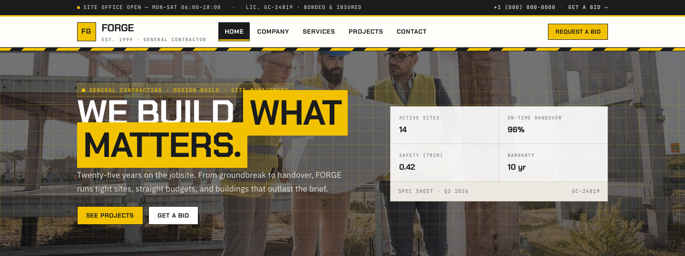

# Construction Company HTML Template — FORGE

A premium, framework-free HTML/CSS/vanilla-JS template for a general contractor. Built bespoke from the subject — industrial jobsite identity, not a recolored scaffold.

**Live preview:** `index.html` (open in browser)  
**Stack:** HTML5 · CSS3 (custom properties, Grid, Flex) · Vanilla JS (no build step)  
**Fonts:** Chakra Petch (display/industrial) · IBM Plex Sans (body) · JetBrains Mono (specs/labels) — via Google Fonts  
**License:** MIT — use commercially, modify freely.

---

## 📸 Screenshot



## Pages

| Page | Description | Link |
|------|-------------|------|
| **Home** | Spec bar, industrial hero (blueprint grid), spec sheet, proof bar, services (6 blueprint cards), about/spec list, portfolio preview, team, site reports, CTA band | [index.html](index.html) |
| **Company** | Story, site method (4 spec-items), timeline (1999→2026), team + safety/bond/warranty | [about.html](about.html) |
| **Services** | 6 services with scope notes + process strip (Precon → Buyout → Build → Handover) | [services.html](services.html) |
| **Projects** | Filterable portfolio grid (data-cat chips) — 9 jobs across 5 sectors | [projects.html](projects.html) |
| **Contact** | Site office card + bid request form with inline validation + yard photo | [contact.html](contact.html) |

---

## Design Distinction

**This template was authored fresh for a construction subject and diverges from every sibling template on all 6 divergence axes:**

| Axis | FORGE (this template) | Siblings (SOURA, OLIVO, VOSSEN, AERION, KORVA, MERIDIAN) |
|------|-----------------------|----------------------------------------------------------|
| **Hero composition** | Full-bleed jobsite photo with blueprint grid overlay (28px yellow grid masked vertically) + two-column hero: headline with safety-yellow highlight + spec sheet (2×2 KPIs + foot). No centered text, no illustration. | Centered headline + subhead + CTA button(s) over gradient/image, or masthead+ticker (MERIDIAN). |
| **Layout grammar** | Industrial spec-sheet: spec bar → hazard stripe → proof bar (4 cells) → blueprint service cards → spec-list about → filterable site grid → steel team section → report cards. Every section reads like a jobsite document. | Section-stack or editorial multi-column (MERIDIAN). None use spec bars, hazard stripes, or proof bars. |
| **Typography personality** | **Chakra Petch** (industrial, all-caps, tight) + **IBM Plex Sans** (body) + **JetBrains Mono** (all labels/specs). No serif anywhere. Construction work-order voice. | All siblings use a serif display (Fraunces/Playfair/Cormorant/Newsreader) + humanist sans body. KORVA uses Space Grotesk (lab). |
| **Color logic** | Safety yellow (`--safety`), concrete (`--concrete`), steel blue (`--steel`), rebar rust (`--rust`), hazard red. Paper is warm concrete, not white. Hazard diagonal stripe as a motion token. | Pastel/earth/ink systems; no safety-yellow primary anywhere. KORVA dark lab, MERIDIAN newsprint. |
| **Motion signature** | **Hazard stripe shift** — `repeating-linear-gradient` background-position loop (1.2s linear, `72px`). **Plank slide** reveal — `translateY(14px)` only, no clip-path, no scale. Blink dot on spec bar. | MERIDIAN: ticker + clip-path wipe. Others: fade-up with translateY(18–24px) + cubic-bezier. |
| **Section inventory** | Spec bar → header + nav → hazard rule → blueprint hero → proof bar → services (blueprint cards with tag+pill) → spec-list about → portfolio (filterbar+site grid) → steel team → quotes/report cards → safety CTA band → jobsite footer. Filterable portfolio via `data-cat` chips is unique. | Hero → features → stats → testimonials → CTA → footer (shared pattern). No portfolio grids, no filter bars, no spec bars. |

**Bottom line:** Strip the colors from FORGE and any sibling — they share zero layout grammar, component set, or motion vocabulary. This is a jobsite, not a marketing site or a newspaper.

---

## Features

- **Spec bar** — mono type, licence + hours + blink dot + phone/CTA
- **Hazard rule** — animated diagonal safety stripe (repeating gradient)
- **Blueprint hero** — jobsite photo + yellow grid overlay + spec sheet (Active sites / On-time / TRIR / Warranty)
- **Proof bar** — 4 KPIs on ink (Years / Projects / Crew / Awards)
- **Blueprint service cards** — media + tag + pill meta + link, hover lift
- **Spec-list about** — frame + stamp badge + 4 spec-items (ic + b + span)
- **Filterable portfolio** — `data-cat` chips (All/Commercial/Institutional/Residential/Industrial/Infrastructure), vanilla JS filter
- **Steel team section** — `section--steel` with crew cards + yellow rule
- **Site reports** — quote + mini-quotes with stars
- **Bid form** — `data-form` with `.form-ok`/`.form-err`, no `alert()`
- **Sticky header** — `sitehead` with mark, nav, CTA, burger drawer
- **Scroll reveals** — IntersectionObserver, `.reveal` + `.d1`…`.d4`, plank slide
- **Active nav** — auto-highlight via `location.pathname`
- **Footer year** — `[data-year]` auto-fills current year
- **Reduced motion** — disables hazard shift + reveals
- **Original imagery** — 35 source images from Builderz (`assets/img/`): `carousel-[1-3].jpg`, `service-[1-6].jpg`, `portfolio-[1-6].jpg`, `team-[1-4].jpg`, `about.jpg`, `testimonial-*.jpg`, etc.

---

## Quick Start

```bash
# No install, no build — just open
open index.html
# or serve locally
npx serve .
```

---

## File Structure

```
construction-company-html-template/
├── index.html          # Home
├── about.html          # Company
├── services.html       # Services
├── projects.html       # Projects (filterable)
├── contact.html        # Contact / bid request
├── assets/
│   ├── css/
│   │   └── base.css    # Bespoke design system (~380 lines)
│   ├── js/
│   │   └── main.js     # Bespoke interactions (~50 lines)
│   └── img/            # 35 original Builderz images
└── README.md           # This file
```

---

## Customization

- **Colors:** Edit `:root` tokens in `assets/css/base.css` — `--safety`, `--steel`, `--rust`, `--concrete`
- **Fonts:** Swap Google Fonts `<link>` in each HTML `<head>` and update `--font-display/--font-body/--font-mono`
- **Sections:** Add/remove `.service-grid`, `.portfolio`, `.team`, `.quotes` blocks
- **Projects:** Duplicate `.job` cards, set `data-cat` for filtering, add chips to `.filterbar`
- **Form:** Edit fields in `contact.html` — validation is `checkValidity()` + inline `.form-ok`/`.form-err`

---

## Browser Support

Modern evergreen browsers (Chrome 90+, Firefox 88+, Safari 14+, Edge 90+).  
Graceful degradation: CSS custom properties, Grid, Flex, `clamp()`, `IntersectionObserver`.

---

## Credits

- **Images:** Original Builderz source assets (included in `assets/img/`)
- **Fonts:** Chakra Petch, IBM Plex Sans, JetBrains Mono — all SIL OFL via Google Fonts
- **Icons:** Inline Unicode (◈ ⬢ ⬣ ⬔ ▣) — no icon font

---

Let's Build Something Together 🚀  
https://tally.so/r/q4q1L9
